Cluster Analysis
================

**Cluster analysis** helps \* Identifying cohesive subgroups (clusters)
of observations \* Determining the number of clusters present \*
Obtaning a nested hierarchy of clusters \* Obtaining discrete clusters

1. Common steps in cluster analysis
-----------------------------------

1.  *Choose appropriate attributes*. The first step is to select
    variables that you feel may be important for identifying and
    understanding differences among groups of observations within
    the data.
2.  *Scale the data*. If the variables in the analysis vary in range,
    the variables with the largest range will have the greatest impact
    on the results. Three options are available:

`df1 <- apply(mydata, 2, function(x){x-mean(x)/sd(x)})`

`df2 <- apply(mydata, 2, function(x){x/max(x)})`

`df3 <- apply(mydata, 2, function(x){(x-mean(x))/mad(x)})`

1.  *Screen for outliers*. You can screen for (and remove) univariate
    outliers using functions.
2.  *Calculate distances*. The most popular measure of the distance
    between two observations is the Euclidean distance.
3.  *Select a clustering algorithm*. You select a method of clustering
    the data.
4.  *Obtain one or more cluster solutions*
5.  *Determine the number of clusters present*
6.  *Obtain a final clustering solution*.
7.  *Visualize the results*.
8.  *Interpret the clusters*.

-   What do the observations in a cluster have in common?

1.  *Validate the results*.

2. Calculating distances
------------------------

Euclidean distance between two observations is given by

$d_{ij} = \sqrt{\sum_{p=1}^{p}(x_{ip} - x\_{jp})^2}$
, where i and j are observations and P is the number of variables

    data(nutrient, package="flexclust")
    head(nutrient,4)

    ##              energy protein fat calcium iron
    ## BEEF BRAISED    340      20  28       9  2.6
    ## HAMBURGER       245      21  17       9  2.7
    ## BEEF ROAST      420      15  39       7  2.0
    ## BEEF STEAK      375      19  32       9  2.6

    d <- dist(nutrient)
    as.matrix(d)[1:4,1:4]

    ##              BEEF BRAISED HAMBURGER BEEF ROAST BEEF STEAK
    ## BEEF BRAISED      0.00000   95.6400   80.93429   35.24202
    ## HAMBURGER        95.64000    0.0000  176.49218  130.87784
    ## BEEF ROAST       80.93429  176.4922    0.00000   45.76418
    ## BEEF STEAK       35.24202  130.8778   45.76418    0.00000

3. Hierarchical cluster analysis
--------------------------------

Algorithm is as follows: 1. Define each observation (row, case) as a
cluster 2. Calculate the distances between every cluster and every other
cluster 3. Combine the two clusters that have the smallest distance.
This reduces the number of clusters by one 4. Repeat steps 2 and 3 until
all clusters have been merged into a single cluster containing all
observations

    row.names(nutrient) <- tolower(row.names(nutrient))
    nutrient.scaled <- scale(nutrient)

    d <- dist(nutrient.scaled)

    fit.average <- hclust(d, method = "average")
    plot(fit.average, hang = -1, cex = .8, main = "Average Linkage Clustering")

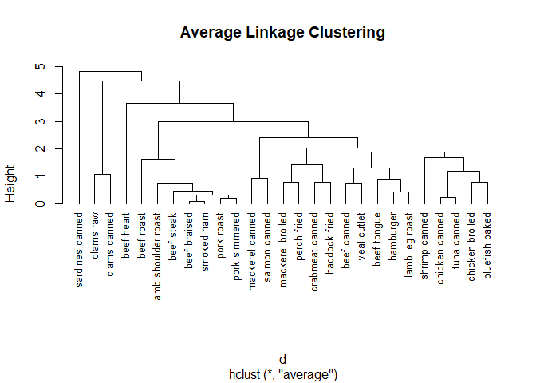

### 3.1 Selecting the number of clusters

    library(NbClust)
    devAskNewPage(ask = TRUE)
    nc <- NbClust(nutrient.scaled, distance = "euclidean",
                  min.nc = 2, max.nc = 15, method = "average")

    ## Warning in pf(beale, pp, df2): NaN이 생성되었습니다

    ## Warning in pf(beale, pp, df2): NaN이 생성되었습니다

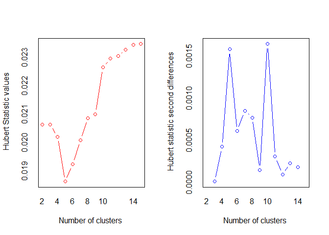

    ## *** : The Hubert index is a graphical method of determining the number of clusters.
    ##                 In the plot of Hubert index, we seek a significant knee that corresponds to a 
    ##                 significant increase of the value of the measure i.e the significant peak in Hubert
    ##                 index second differences plot. 
    ## 

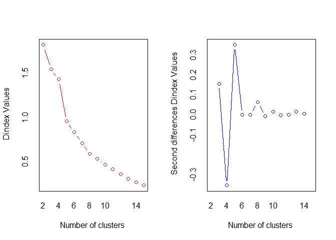

    ## *** : The D index is a graphical method of determining the number of clusters. 
    ##                 In the plot of D index, we seek a significant knee (the significant peak in Dindex
    ##                 second differences plot) that corresponds to a significant increase of the value of
    ##                 the measure. 
    ##  
    ## ******************************************************************* 
    ## * Among all indices:                                                
    ## * 4 proposed 2 as the best number of clusters 
    ## * 4 proposed 3 as the best number of clusters 
    ## * 2 proposed 4 as the best number of clusters 
    ## * 4 proposed 5 as the best number of clusters 
    ## * 1 proposed 9 as the best number of clusters 
    ## * 1 proposed 10 as the best number of clusters 
    ## * 2 proposed 13 as the best number of clusters 
    ## * 1 proposed 14 as the best number of clusters 
    ## * 4 proposed 15 as the best number of clusters 
    ## 
    ##                    ***** Conclusion *****                            
    ##  
    ## * According to the majority rule, the best number of clusters is  2 
    ##  
    ##  
    ## *******************************************************************

    table(nc$Best.n[1,])

    ## 
    ##  0  1  2  3  4  5  9 10 13 14 15 
    ##  2  1  4  4  2  4  1  1  2  1  4

    barplot(table(nc$Best.n[1,]),
            xlab = "Number of Clusters",ylab = "Number of Criteria",
            main = "Number of Clusters Chosen by 26 Criteria")

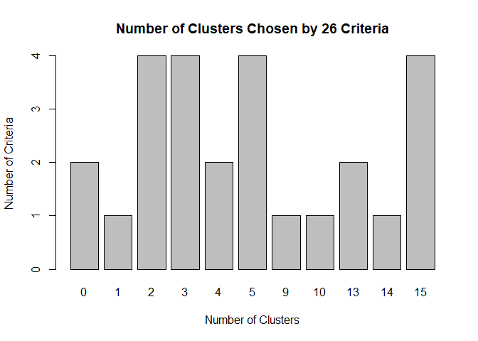

### 3.2 Obtaning the final cluster solution

    clusters <- cutree(fit.average,k=5) #Assigning cases
    table(clusters)

    ## clusters
    ##  1  2  3  4  5 
    ##  7 16  1  2  1

    aggregate(nutrient, by=list(cluster=clusters), median) # Describes clusters

    ##   cluster energy protein fat calcium iron
    ## 1       1  340.0      19  29       9 2.50
    ## 2       2  170.0      20   8      13 1.45
    ## 3       3  160.0      26   5      14 5.90
    ## 4       4   57.5       9   1      78 5.70
    ## 5       5  180.0      22   9     367 2.50

    plot(fit.average,hang=-1,cex = .8,
         main = "Average Linkage Clustering \n 5 Cluster Solution")
    rect.hclust(fit.average,k=5)

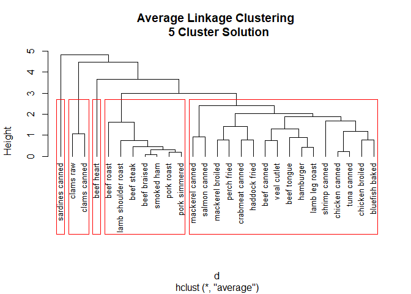

4. Partitioning cluster analysis
--------------------------------

### 4.1 K-means clustering

**Algorithms as follow:** 1. Select K centroids (K rows chosen at
random) 2. Assign each data point to its closest centroid 3. Recalculate
the centroids as the average of all data points in a cluster (That is,
the centroids are p-length mean vectors, where p is the number of
vairables) 4. Assign data poins to their closest centroids 5. Continue
steps 3 and 4 until the observations aren't reassigned or the maximum
number of iterations ( R uses 10 as a dsfault) is reached.

\begin{align}
ss(k) = \sum_{i=1}^n \sum_{j=0}^p (x_{ij} - \bar{x}_{kj})^2 \\
\end{align}
where k is the cluster, x\_{ij} is the value of the j^{th} variable for
the i^{th} observation, {x}\_{kj} is the mean of the j^{th} variable for
the k^{th} cluster, and p is the number of variables.

    data(wine, package = "rattle")
    head(wine)

    ##   Type Alcohol Malic  Ash Alcalinity Magnesium Phenols Flavanoids
    ## 1    1   14.23  1.71 2.43       15.6       127    2.80       3.06
    ## 2    1   13.20  1.78 2.14       11.2       100    2.65       2.76
    ## 3    1   13.16  2.36 2.67       18.6       101    2.80       3.24
    ## 4    1   14.37  1.95 2.50       16.8       113    3.85       3.49
    ## 5    1   13.24  2.59 2.87       21.0       118    2.80       2.69
    ## 6    1   14.20  1.76 2.45       15.2       112    3.27       3.39
    ##   Nonflavanoids Proanthocyanins Color  Hue Dilution Proline
    ## 1          0.28            2.29  5.64 1.04     3.92    1065
    ## 2          0.26            1.28  4.38 1.05     3.40    1050
    ## 3          0.30            2.81  5.68 1.03     3.17    1185
    ## 4          0.24            2.18  7.80 0.86     3.45    1480
    ## 5          0.39            1.82  4.32 1.04     2.93     735
    ## 6          0.34            1.97  6.75 1.05     2.85    1450

    df <- scale(wine[-1])

    wssplot <-function(data, nc = 15, seed = 1234){
      wss <- (nrow(data)-1)*sum(apply(data,2,var))
      for(i in 2:nc){
        set.seed(seed)
        wss[i] <- sum(kmeans(data, centers = i)$withinss)
      }
      plot(1:nc,wss, type = "b", xlab = "Number of Clusters",
           ylab = "Within groups sum of squares")
    }

    wssplot(df)

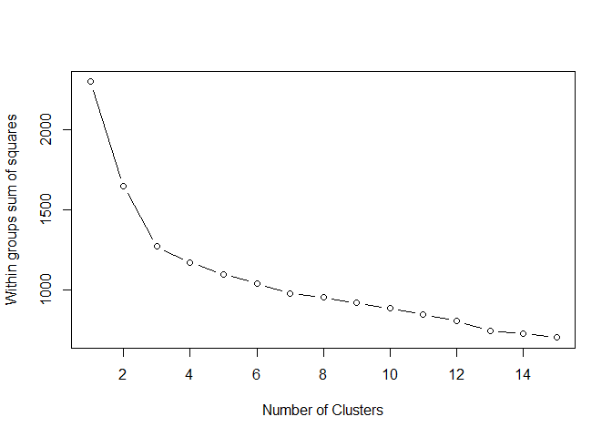

    library(NbClust)
    set.seed(1234)
    devAskNewPage(ask = TRUE)
    nc <- NbClust(df, min.nc = 2, max.nc = 15, method = "kmeans")

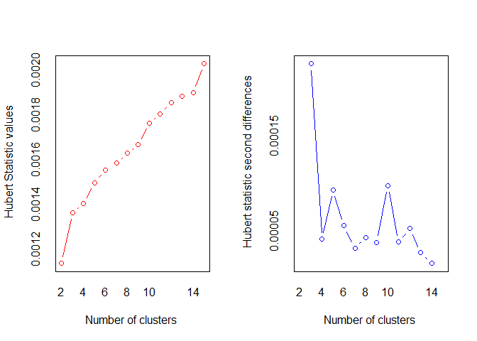

    ## *** : The Hubert index is a graphical method of determining the number of clusters.
    ##                 In the plot of Hubert index, we seek a significant knee that corresponds to a 
    ##                 significant increase of the value of the measure i.e the significant peak in Hubert
    ##                 index second differences plot. 
    ## 

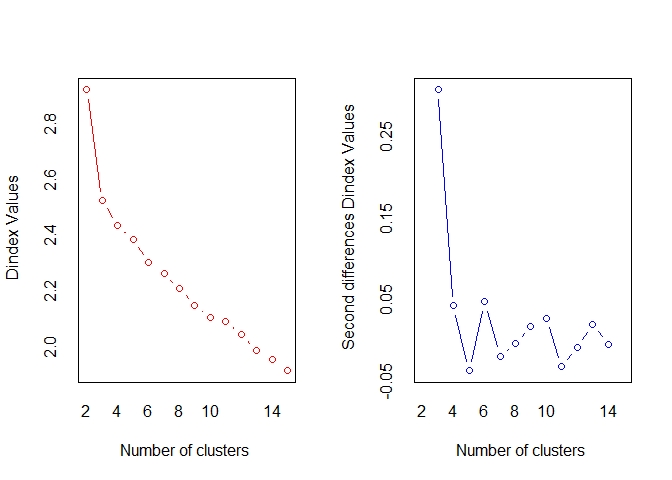

    ## *** : The D index is a graphical method of determining the number of clusters. 
    ##                 In the plot of D index, we seek a significant knee (the significant peak in Dindex
    ##                 second differences plot) that corresponds to a significant increase of the value of
    ##                 the measure. 
    ##  
    ## ******************************************************************* 
    ## * Among all indices:                                                
    ## * 4 proposed 2 as the best number of clusters 
    ## * 15 proposed 3 as the best number of clusters 
    ## * 1 proposed 10 as the best number of clusters 
    ## * 1 proposed 12 as the best number of clusters 
    ## * 1 proposed 14 as the best number of clusters 
    ## * 1 proposed 15 as the best number of clusters 
    ## 
    ##                    ***** Conclusion *****                            
    ##  
    ## * According to the majority rule, the best number of clusters is  3 
    ##  
    ##  
    ## *******************************************************************

    table(nc$Best.n[1,])

    ## 
    ##  0  1  2  3 10 12 14 15 
    ##  2  1  4 15  1  1  1  1

    barplot(table(nc$Best.n[1,]),
            xlab = "Number of Clusters", ylab = "Number of Criteria",
            main = "Number of Clusters Chosen by 26 Criteria")

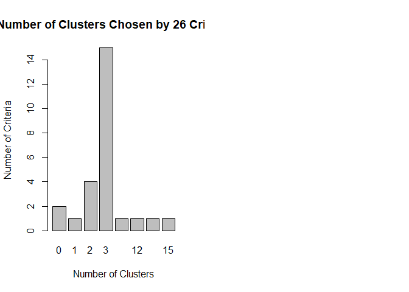

    set.seed(1234)
    fit.km <- kmeans(df,3, nstart = 25)
    fit.km$size

    ## [1] 62 65 51

    fit.km$centers

    ##      Alcohol      Malic        Ash Alcalinity   Magnesium     Phenols
    ## 1  0.8328826 -0.3029551  0.3636801 -0.6084749  0.57596208  0.88274724
    ## 2 -0.9234669 -0.3929331 -0.4931257  0.1701220 -0.49032869 -0.07576891
    ## 3  0.1644436  0.8690954  0.1863726  0.5228924 -0.07526047 -0.97657548
    ##    Flavanoids Nonflavanoids Proanthocyanins      Color        Hue
    ## 1  0.97506900   -0.56050853      0.57865427  0.1705823  0.4726504
    ## 2  0.02075402   -0.03343924      0.05810161 -0.8993770  0.4605046
    ## 3 -1.21182921    0.72402116     -0.77751312  0.9388902 -1.1615122
    ##     Dilution    Proline
    ## 1  0.7770551  1.1220202
    ## 2  0.2700025 -0.7517257
    ## 3 -1.2887761 -0.4059428

    aggregate(wine[-1], by = list(cluster=fit.km$cluster),mean)

    ##   cluster  Alcohol    Malic      Ash Alcalinity Magnesium  Phenols
    ## 1       1 13.67677 1.997903 2.466290   17.46290 107.96774 2.847581
    ## 2       2 12.25092 1.897385 2.231231   20.06308  92.73846 2.247692
    ## 3       3 13.13412 3.307255 2.417647   21.24118  98.66667 1.683922
    ##   Flavanoids Nonflavanoids Proanthocyanins    Color       Hue Dilution
    ## 1  3.0032258     0.2920968        1.922097 5.453548 1.0654839 3.163387
    ## 2  2.0500000     0.3576923        1.624154 2.973077 1.0627077 2.803385
    ## 3  0.8188235     0.4519608        1.145882 7.234706 0.6919608 1.696667
    ##     Proline
    ## 1 1100.2258
    ## 2  510.1692
    ## 3  619.0588

### 4.2 Partitioning around medoids (PAM)

Whereas k-means uses Euclidean distances, PAM can be based on any
distance measure. It can accommodate mixed data types and isn't limited
to continuous variables.

*medoid* : The most representativs observation of each cluster

**The PAM algorithms is as follows**: 1. Randomly select K observations
(call each 3 medoid) 2. Calculate the distance/dissimilarity of every
observation to each medoid. 3. Assign each observation to its closest
medoid. 4. Calculate the sum of the distances of each observation from
its medoid (total cost). 5. Select a point that isn't a medoid, and swap
it with its medoid. 6. Reassign every point to its closest medoid. 7.
Calculate the total cost. 8. If this total cost is smaller, keep the new
point as a medoid. 9. Repeat steps 5-8 until the medoids don't change

    library(cluster)

    set.seed(1234)
    fit.pam <- pam(wine[-1], k = 3, stand = TRUE) # Cluters standardized data
    fit.pam$medoids

    ##      Alcohol Malic  Ash Alcalinity Magnesium Phenols Flavanoids
    ## [1,]   13.48  1.81 2.41       20.5       100    2.70       2.98
    ## [2,]   12.25  1.73 2.12       19.0        80    1.65       2.03
    ## [3,]   13.40  3.91 2.48       23.0       102    1.80       0.75
    ##      Nonflavanoids Proanthocyanins Color  Hue Dilution Proline
    ## [1,]          0.26            1.86   5.1 1.04     3.47     920
    ## [2,]          0.37            1.63   3.4 1.00     3.17     510
    ## [3,]          0.43            1.41   7.3 0.70     1.56     750

    clusplot(fit.pam, main = "Bivariate Cluster Plot")

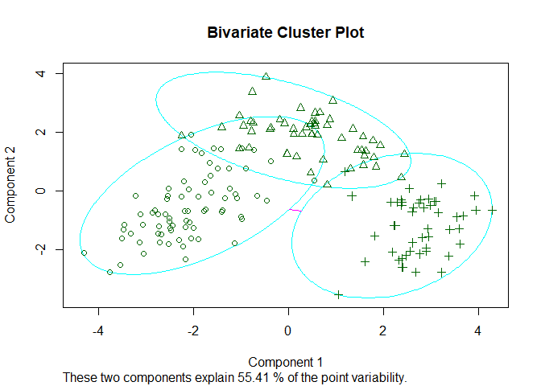

    ct.pam <- table(wine$Type, fit.pam$clustering)
    library(flexclust)
    randIndex(ct.pam)

    ##       ARI 
    ## 0.6994957

5. Avoiding nonexistent clusters
--------------------------------

    library(fMultivar)
    set.seed(1234)
    df <- rnorm2d(1000,rho=.5)
    df <- as.data.frame(df)
    plot(df, main = "Bivariate Normal Distribution with rho = 0.5")

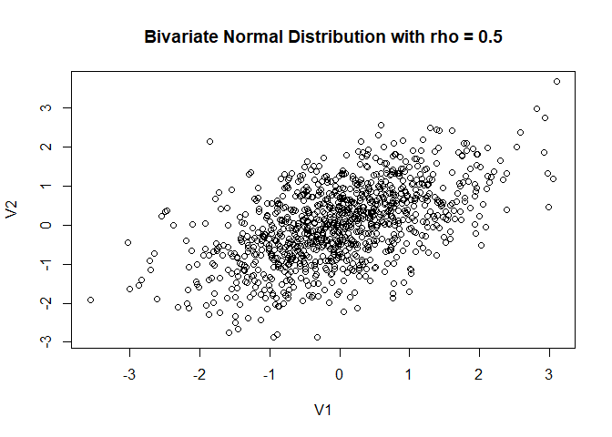

From the plot above, we cannot distinguish clear cluster. We can use
wssplot() and NbClust() functions to determine the number of clusters
present

    wssplot(df)

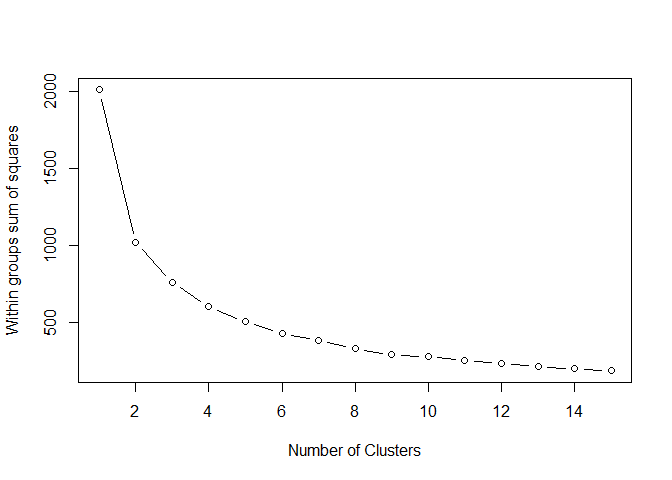

    library(NbClust)
    nc <- NbClust(df, min.nc = 2, max.nc = 15, method = "kmeans")

    ## *** : The Hubert index is a graphical method of determining the number of clusters.
    ##                 In the plot of Hubert index, we seek a significant knee that corresponds to a 
    ##                 significant increase of the value of the measure i.e the significant peak in Hubert
    ##                 index second differences plot. 
    ## 

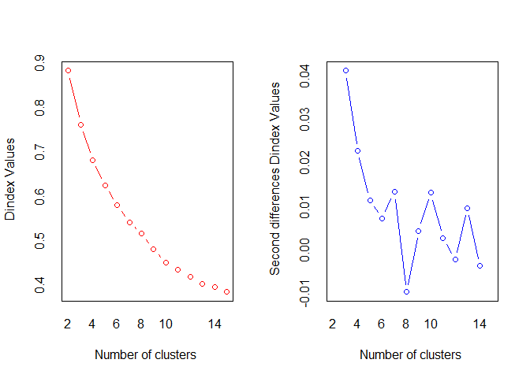

    ## *** : The D index is a graphical method of determining the number of clusters. 
    ##                 In the plot of D index, we seek a significant knee (the significant peak in Dindex
    ##                 second differences plot) that corresponds to a significant increase of the value of
    ##                 the measure. 
    ##  
    ## ******************************************************************* 
    ## * Among all indices:                                                
    ## * 8 proposed 2 as the best number of clusters 
    ## * 5 proposed 3 as the best number of clusters 
    ## * 1 proposed 4 as the best number of clusters 
    ## * 1 proposed 5 as the best number of clusters 
    ## * 1 proposed 8 as the best number of clusters 
    ## * 4 proposed 10 as the best number of clusters 
    ## * 1 proposed 12 as the best number of clusters 
    ## * 2 proposed 13 as the best number of clusters 
    ## 
    ##                    ***** Conclusion *****                            
    ##  
    ## * According to the majority rule, the best number of clusters is  2 
    ##  
    ##  
    ## *******************************************************************

    dev.new()
    barplot(table(nc$Best.n[1,]),
            xlab = "Number of Clusters", ylab = "Number of Criteria",
            main = "Number of Clusters Chosen by 26 Criteria")
